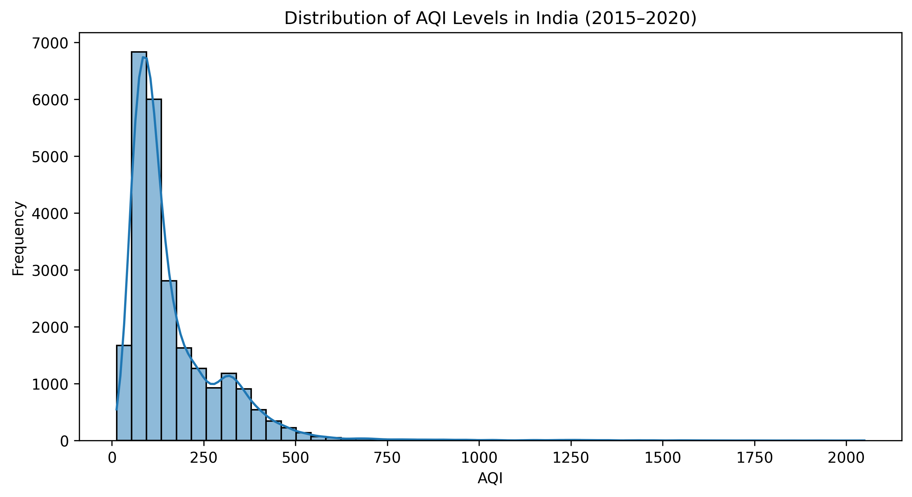
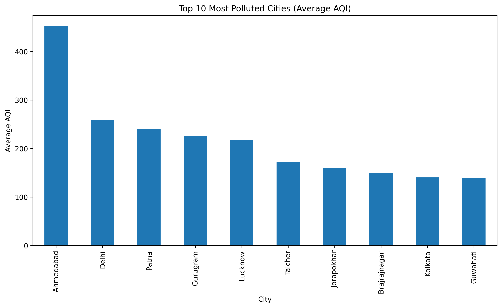
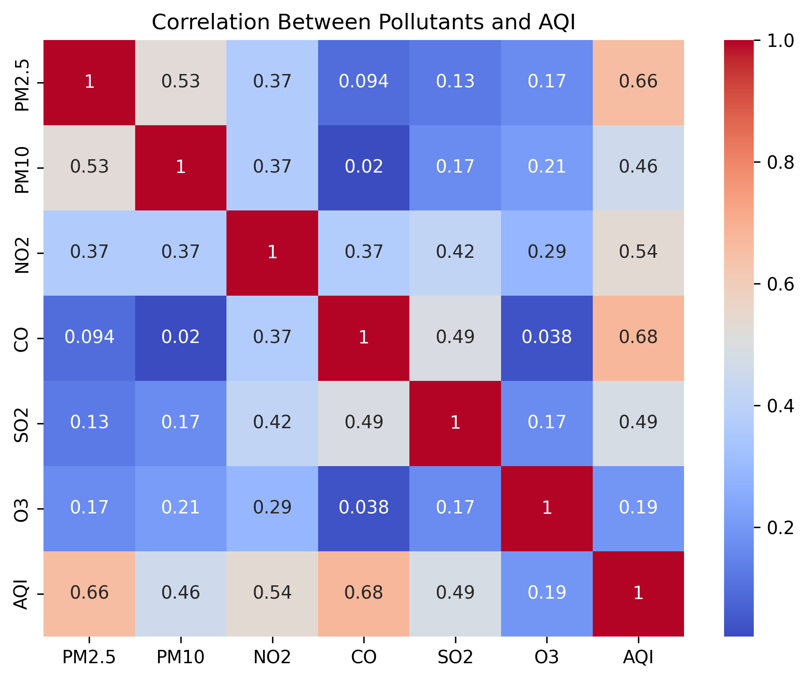
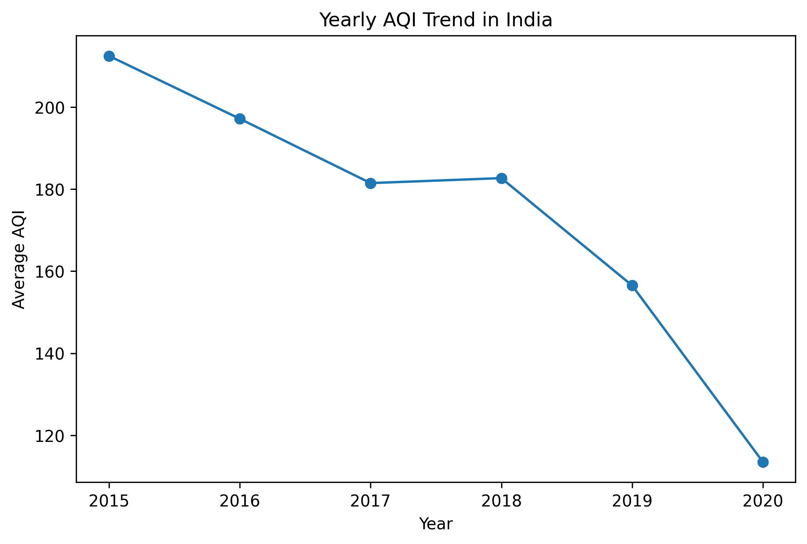

# Air Quality Analysis (India 2015–2020)

A data analysis project exploring air pollution trends across Indian cities using AQI and pollutant metrics to uncover key environmental patterns.

---

## Project Overview

This project analyzes air quality trends across Indian cities between 2015 and 2020. The objective is to identify pollution patterns, understand key contributing pollutants, and examine how air quality varies across cities and over time.

---

## Sample Visualizations

### AQI Distribution



### Top Polluted Cities



### Pollutant Correlation



### Yearly AQI Trend



---

## Dataset

* Source: Kaggle – Air Quality Data in India (2015–2020)
* Data used: City-level daily air quality data
* Features: AQI, PM2.5, PM10, NO2, CO, SO2, O3

---

## Data Processing

* Organized dataset into raw and processed formats
* Selected relevant features for analysis
* Handled missing values using appropriate methods
* Converted date column to datetime format
* Created a clean dataset for analysis

---

## Exploratory Analysis

The following analyses were performed:

* Distribution of AQI values across cities
* Identification of most polluted cities
* Correlation between pollutants and AQI
* Yearly trends in air quality

---

## Key Insights

* PM2.5 shows the strongest correlation with AQI, making it the primary driver of air pollution.
* Several cities consistently record high AQI levels, indicating persistent environmental pressure.
* AQI distribution is right-skewed, meaning extreme pollution events occur but are less frequent.
* Yearly trends show inconsistent improvement, suggesting pollution control measures have not had sustained long-term impact.
* Missing data patterns indicate inconsistencies in environmental monitoring across locations.

---

## Outputs

* Figures → `outputs/figures/`
* Tables → `outputs/tables/`
* Insights → `outputs/insights/`

---

## Tools Used

* Python (Pandas, NumPy)
* Matplotlib, Seaborn
* Jupyter Notebook

---

## 🚀 How to Run

1. Clone the repository
2. Install dependencies

   ```bash
   pip install -r requirements.txt
   ```
3. Run notebooks in order:

   * `01_data_cleaning.ipynb`
   * `02_exploratory_analysis.ipynb`

---

## 📁 Project Structure

```
air-quality-analysis-india/
│
├── data/
│   ├── raw/
│   └── processed/
│
├── notebooks/
│   ├── 01_data_cleaning.ipynb
│   └── 02_exploratory_analysis.ipynb
│
├── outputs/
│   ├── figures/
│   ├── tables/
│   └── insights/
│
├── README.md
└── requirements.txt
```
